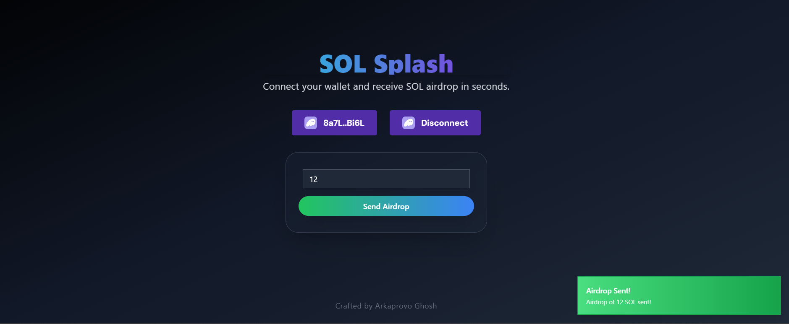

# SOL Splash: A Solana Airdrop DApp

Welcome to SOL Splash! This innovative decentralized application allows you to effortlessly connect your Solana wallet and receive SOL airdrops in just a few clicks. Designed for both newcomers and seasoned crypto enthusiasts, SOL Splash simplifies the airdrop process and enhances your experience in the vibrant Solana ecosystem.

 

## Features

- Wallet Integration: Seamlessly connect your Solana wallet with support for multiple wallet providers.
- Instant Airdrops: Quickly receive SOL by entering your desired amount, making it easy to get started with your Solana journey.
- User-Centric Design: Enjoy a modern, intuitive interface that provides a delightful user experience.
- Mobile-Friendly: Fully responsive design ensures smooth operation on all devices, from desktops to smartphones.

## Table of Contents

- Installation
- Usage
- Technologies
- Contributing
- License

## Installation

Follow these steps to set up the SOL Splash DApp on your local machine:

1. Clone the repository:
   ```
   git clone https://github.com/your-username/solana-airdrop-dapp.git
   ```
   Replace `your-username` with your GitHub username.

2. Navigate to the project directory:
   ```
   cd solana-airdrop-dapp
   ```

3. Install the dependencies:
   ```
   npm install
   ```

4. Set up environment variables:
   Create a `.env` file in the root directory and define the Solana endpoint:
   ```
   VITE_SOLANA_ENDPOINT=your-solana-endpoint-url
   ```

5. Start the development server:
   ```
   npm run dev
   ```

6. Access the DApp:
   Open your browser and navigate to `http://localhost:3000` to explore SOL Splash.

## Usage

1. Connect Your Wallet: Click on the "Connect Wallet" button to link your Solana wallet effortlessly.
2. Specify Amount: Enter the amount of SOL you wish to receive in the airdrop.
3. Initiate Airdrop: Hit the "Send Airdrop" button to start the airdrop process and enjoy your SOL!

## Technologies

This project leverages the following technologies:

- React: A powerful JavaScript library for building interactive user interfaces.
- TypeScript: A strict syntactical superset of JavaScript, enhancing development with strong typing.
- Solana Wallet Adapter: A library that simplifies wallet integration for Solana applications.
- Tailwind CSS: A utility-first CSS framework for creating stylish and responsive designs.
- Vite: A modern build tool that provides a fast development environment.

## Contributing

Contributions are welcome! If you'd like to contribute to the project, please follow these steps:

1. Fork the repository.
2. Create your feature branch (`git checkout -b feature/MyFeature`).
3. Commit your changes (`git commit -m 'Add some feature'`).
4. Push to the branch (`git push origin feature/MyFeature`).
5. Open a Pull Request.