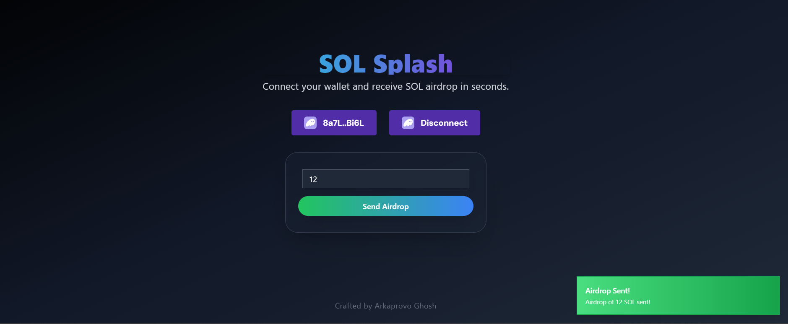

Here’s the README in Markdown format for easy copying:

```markdown
# Solana Airdrop DApp

Welcome to the **Solana Airdrop DApp**! This decentralized application allows users to easily connect their wallets and receive SOL airdrops in seconds, enhancing your experience in the Solana ecosystem.

 <!-- Replace with actual path to a screenshot -->

## Features

- **Connect Your Wallet**: Easily connect to your Solana wallet using Wallet Adapter.
- **Receive Airdrops**: Get instant SOL airdrops by entering the desired amount.
- **User-Friendly Interface**: A clean, modern UI for a seamless user experience.
- **Responsive Design**: Works flawlessly on various devices.

## Table of Contents

- [Installation](#installation)
- [Usage](#usage)
- [Technologies](#technologies)
- [Contributing](#contributing)
- [License](#license)

## Installation

To get started with the Solana Airdrop DApp, follow these steps:

1. **Clone the repository**:
   ```bash
   git clone https://github.com/your-username/solana-airdrop-dapp.git
   ```
   Replace `your-username` with your GitHub username.

2. **Navigate to the project directory**:
   ```bash
   cd solana-airdrop-dapp
   ```

3. **Install the dependencies**:
   ```bash
   npm install
   ```

4. **Set up your environment variables**:
   Create a `.env` file in the root directory and set the Solana endpoint:
   ```
   VITE_SOLANA_ENDPOINT=your-solana-endpoint-url
   ```

5. **Start the development server**:
   ```bash
   npm run dev
   ```

6. **Open your browser**:
   Go to `http://localhost:3000` to view the DApp.

## Usage

1. **Connect Your Wallet**: Click on the "Connect Wallet" button to link your Solana wallet.
2. **Enter Amount**: Input the desired amount of SOL you wish to receive in the airdrop.
3. **Receive Airdrop**: Click the "Send Airdrop" button to initiate the airdrop process.

## Technologies

This project utilizes the following technologies:

- **React**: A JavaScript library for building user interfaces.
- **TypeScript**: A typed superset of JavaScript that compiles to plain JavaScript.
- **Solana Wallet Adapter**: A set of tools to integrate Solana wallet functionality.
- **Tailwind CSS**: A utility-first CSS framework for styling.
- **Vite**: A build tool that provides a fast development environment.

## Contributing

Contributions are welcome! If you'd like to contribute to the project, please follow these steps:

1. Fork the repository.
2. Create your feature branch (`git checkout -b feature/MyFeature`).
3. Commit your changes (`git commit -m 'Add some feature'`).
4. Push to the branch (`git push origin feature/MyFeature`).
5. Open a Pull Request.

## License

This project is licensed under the MIT License. See the [LICENSE](./LICENSE) file for details.
```

Feel free to paste this directly into your `README.md` file!